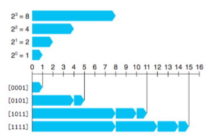

# Section 2.2 整数表示

## 2.2.1 整数数据类型

| type               | min                        | max                        |
| ------------------ | -------------------------- | -------------------------- |
| (signed) char      | -128                       | 127                        |
| char               | 0                          | 255                        |
| int2(short)        | -32768                     | 32767                      |
| uint2              | 0                          | 65535                      |
| int4(int, long@32) | -2147483648                | 2147483647                 |
| uint4              | 0                          | 4,294,967,295              |
| int8(long long)    | -9,223,372,036,854,775,808 | 9,223,372,036,854,775,807  |
| uint8              | 0                          | 18,446,744,073,709,551,615 |

对于有符号数，负数的取值范围比正数的范围大1。

能表示数的个数一定是偶数，所以要么0有两种表示：+0与-0，要么正数与负数数目是不对称的。

这导致了TMIN没有对应的正数，在一些情况下可能会产生错误。

对于long类型，32位机器上是4字节，64位机器上是8字节。Java只有有符号数。


## 2.2.2 无符号数的编码

无符号数编码的定义
$$
B2U_{w}(\vec{x}) :=\sum_{i=0}^{w-1}{x_i2^i}
$$
这个编码将一个长度为w的位向量**一一映射**到[0~2^w-1]之间的对应值。

即建立了位向量空间与有限自然数空间的一一映射，用位向量表示自然数（有限）！



## 2.2.3 整数编码——补码

除了正数，我们还希望表示负数。这就需要一种新的编码方式，将位向量编码到（有限）整数空间。

这种编码称为**补码（Two's complement）**
$$
B2T_{w}(\vec{x}) :=-x_{w-1}2^{w-1}+ \sum_{i=0}^{w-2}{x_i2^i}
$$
补码可以解释为：最高位是符号位。是一个负权项。

补码的特点：

* 最大值与最小值不对称，|TMin| = |TMax|+1。
* 无符号数最大值 UMax = 2*|TMax| + 1，无符号数最大值解释为有符号数时为-1。
* 关于最大最小值，`limits.h`中定义了这些常量。`stdint.h`中定义了`intN_t`这些类型。


用位向量编码整数的方式不是唯一的，还有几种：

* 原码(Sign-Magnitude)：用最高位表示符号位
  $$
  B2T_{w}(\vec{x}) :=(-1)^{x_{w-1}} \sum_{i=0}^{w-2}{x_i2^i}
  $$
  原码在浮点数编码中还可以看见

* 反码(Ones‘  complement)，相比最高位的权少了1，效果上负数等于对应正数位模式取反。

$$
B2O_{w}(\vec{x}) :=-x_{w-1}(2^{w-1}-1)+\sum_{i=0}^{w-1}{x_i2^i}
$$

反码的好处是计算简单，-x补码的算法是$2^{w-1}-x$，而-x反码只要对x各位（包括符号位）取反就可以了。

这两种编码最大的问题就是0有两种表示方法。

还有一些其他的编码方式：比如格雷码，每两个相邻数字之间只有一位不同，减小异常产生的误差。

#### 补码与反码的名称由来

**补码（Two's complement）**的名称翻译是：2的补全。之所以这么翻译是有原因的。

对于非负数x，如果要计算-x的w位向量表示，我们使用 `2^w - x`来计算。也就是`1[000..000] -x`，x + (-x) 对于自然数加法而言等于0，对于补码加法而言，其和其实等于`2^w`，然后溢出w位向量的表示范围从而变为0。

**反码(Ones' complement)**的名称翻译是：1们的补全，原因是

计算-x的反码时，计算方式是`[111...11111] -x`

补码和反码之间存在一些微妙的关系：¬x = -x + 1

这里¬x代表对x按位取反，实际上就是-x用反码表示。

-x就是-x的补码表示，这两者之间的关系就是，反码表示+1会得到补码表示。这是很自然的。

```
1. −x=¬x+1=¬(x−1)
2. x+y=x−(−y)⁆
	=x−¬y−1)⁆
	=(x⨁y)+2(x&y)⁆
	=(x|y)+(x&y)⁆
	=2(x│y)−(x⨁y)
3. x−y=x+(−y)⁆
	=x+¬y+1⁆
	=(x⨁y)−2(¬x&y)⁆
	=(x&¬y)+(¬x&y)⁆
	=2(x&¬y)−(x⨁y)
4. ¬x=−x−1
5. x & y=(¬x ┤|  y ) −¬x
x | y=(x & ¬y)+y
```


#### 练习题2.18

```
736
-88 [ a8 ff ff ff ] [10101000 11111111 11111111 11111111 ]
40
-48
120
136
504
8
192
-72
736
```


## 2.2.4 有符号数与无符号数之间的转换

有符号数与无符号数之间转换，我们可能期望它有各种各样的性质，可惜机器并不这么想。

转换规则很简单，位模式不变，解释方法改变。

```c
int main(){
    short int v = -12345;
    unsigned short uv = (unsigned short)v;
    printf("v = %d, uv = %u\n", v, uv);
}
```

#### 补码转无符号数

(int -> uint)
$$
T2U_w(x)=\left\{
\begin{array}{rcl}
x+2^w &{(x<0)}\\
x & {(x\ge0)}\\
\end{array} \right.
$$
转为无符号数时，非负数不变，负数溢出加上2^w。

#### 无符号数转补码

(uint -> int)
$$
U2T_w(u)=\left\{
\begin{array}{rcl}
u &{(u\le TMax_w)}\\
u -2^w & {(x>TMax_w)}\\
\end{array} \right.
$$
转为带符号数时，没超过最大值的不变，超过最大值的溢出为负数，减去2^w

## 2.1.5 C语言中的整数

#### 注意事项

**注意**无符号数和有符号数这里有两个大坑，第一个是C语言中的无符号数和有符号数一起运算的时候，会将有符号数转换为无符号数参与运算，所以在无符号数和负数比较大小的时候，负数就会被提升为无符号数，变成一个很大的数，导致一些蛋疼的错误。

第二点是带符号数的最小值不能写为，例如：-2147483648。而要携程-2147483647-1 。因为这个负号实际上是一个一元运算符，因为带符号数负数的表示范围比整数大1，它后面那个操作数实际溢出了正数的表示范围……。

#### 练习题2.21

```c
void exercise2_21(){
    printf("\n============================\nExercise2.21:\n");
    printf(" -2147483647-1 == 2147483648U \t%d\n", -2147483647-1 == 2147483648U);
    printf(" -2147483647-1 < 2147483647 \t%d\n",    -2147483647-1  <  2147483647 );
    printf(" -2147483647-1U < 2147483647 \t%u,%d\n",  -2147483647-1U <   2147483647 );
    printf(" -2147483647-1 < -2147483647 \t%d\n",   -2147483647-1  < -2147483647 );
    printf(" -2147483647-1U <  -2147483647 \t%d %u\n", -2147483647-1U < -2147483647,-2147483647 );
}
```


## 2.1.6 扩展数字的位表示

当我们希望将较小的数据类型扩展到一个较大的数据类型并保持其值不变时，需要进行扩展。

**零扩展（Zero Extension）**

定义宽度为$w$的位向量$\vec{u}=[u_{w-1},u_{w-2},…,u_0]$和宽度为$w'$的位向量$\vec{u}'=[0,...,0, u_{w-1},u_{w-2},…,u_0]$，其中$w'>w$。则$B2U_w(\vec{u})=B2U_{w'}(\vec{u})$


扩展无符号数，直接在前面添加0就可以了。也就是说，两个长度不同的位向量，被映射为同一个补码值。较短的位向量扩展为较长的位向量后，原来编码的数值保持不变。

##### 符号扩展（Sign Extension）

定义宽度为$w$的位向量$\vec{u}=[u_{w-1},u_{w-2},…,u_0]$和宽度为$w'$的位向量$\vec{u}'=[u_{w-1},...u_{w-1}, u_{w-1},u_{w-2},…,u_0]$，其中$w'>w$。则$B2T_w(\vec{u})=B2T_{w'}(\vec{u})$

符号扩展在位向量前添加向量最高位的值。

另外一个tricky的地方是，

```c
    short sx = -12345;
    unsigned short uy = sx;
    printf("uy = %u:\t",uy);
结果不是53191而是4294954951，因为实际上是(unsigned)(int)sx
```

#### 练习题2.23

```c
int func1(unsigned word){
    return (int)((word << 24)>>24);
}


int func2(unsigned word){
    return ((int) word << 24)>>24;
}

void exercise2_23(){
    printf("\n============================\nExercise2.23:\n");
    int w1 = 0x00000076,w2=0x87654321,w3=0x000000c9,w4=0xEDCBA987;
    printf("%x func1(w)=%x func2(w)=%x\n",w1,func1(w1),func2(w1) );
    printf("%x func1(w)=%x func2(w)=%x\n",w1,func1(w2),func2(w2) );
    printf("%x func1(w)=%x func2(w)=%x\n",w1,func1(w3),func2(w3) );
    printf("%x func1(w)=%x func2(w)=%x\n",w1,func1(w4),func2(w4) );
}

func1(w)=76 func2(w)=76
func1(w)=21 func2(w)=21
func1(w)=c9 func2(w)=ffffffc9
func1(w)=87 func2(w)=ffffff87
```


## 2.1.7 截断数字

截断数字依然遵循“位模式不变，解释方法改变”的原则。

无符号数的截断，简单的取模即可。

有符号数的截断，取模得到相应无符号数后按照有符号数的方式解释即可。

#### 练习题2.24

将4位数值截断至三位，首先模个8取余得到无符号数。0~7，对应有符号数范围-4~3

```
0	0	0
2	2	2
9	1	1
11	3	3
15	7	-1
```

#### 练习题2.25

```c
/* WARNING: This is buggy code */
float sum_elements(float a[], unsigned lenght){
    int i ;
    float result = 0;

    for (i = 0 ; i <= length; i++){
        result += a[i];
    }
}
```

当length=0时，i<=length成立，所以执行一次循环，越界访问数组a。

把小于等于改为小于即可。


#### 练习题2.26

```c
size_t strlen(const char *s);

/* WARNING Buggy code*/
int strlonger(char *s, char *t){
    return strlen(s) - strlen(t) > 0;
}
```

A. 当t字符串比s长时

B. 相减得到负数，提升为正数，得到意外的结果。

C. 直接判断两个数值的大小。

