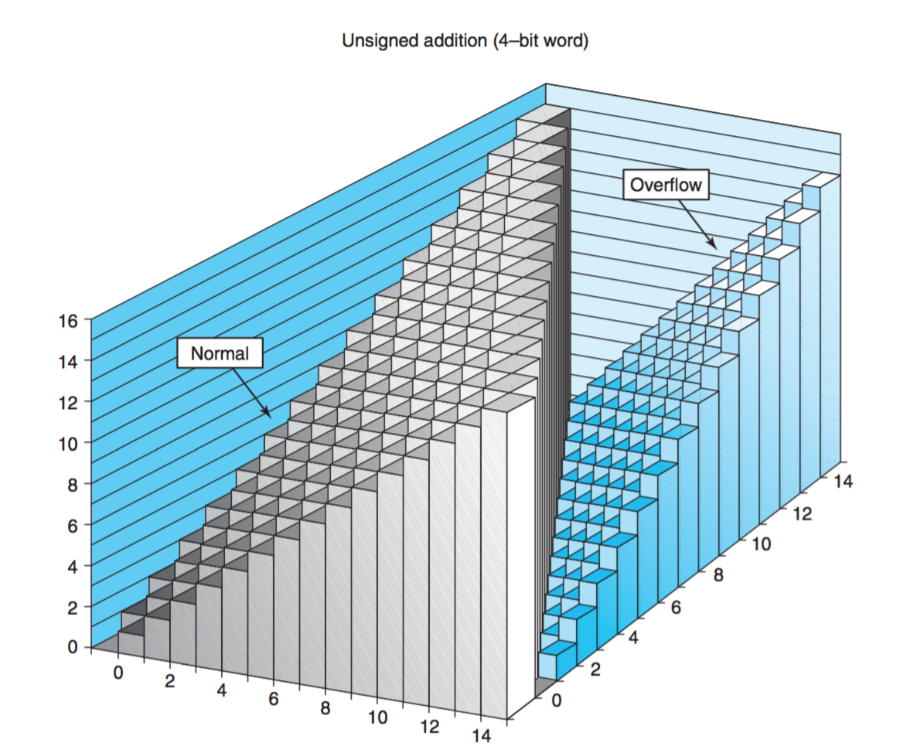
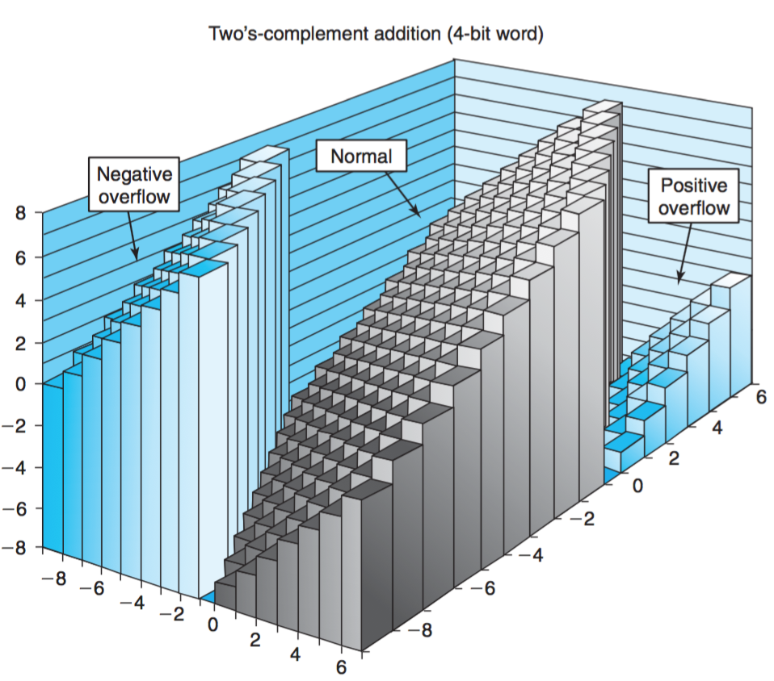

# Section 2.3 整数运算

两个正数相加得到负数，x<y与x-y<0并不等价，这样的事情在计算机系统中是可能发生的，前提是需要对加减法重新定义。

## 2.3.1 无符号加法
对满足$0≤x,y<2^w$的x和y，有
$$
x +_w^u y =\left\{
\begin{array}{rcl}
x + y & {(x + y < 2^w)}\\
x + y -2^w & {( 2^w ≤ x + y < 2^{w+1}}) \\
\end{array} \right.
$$


这里的加法，不再是普通的算术加法，而是带模加法。

算术**溢出（Overflow）**是指完整的正数结果不能放到数据类型的字长限制中去。

算术溢出时，x86架构下会产生`Numeric Overflow Exception (#0)`，设置相应标记位。但是C程序并不视溢出为错误而发信号。

##### 无符号数加法溢出检测

检测无符号数加法溢出的方法很简单：

	当和小于加数与被加数任意一者时，可认为发生溢出。
#### 练习题2.27

```c
int uadd_ok(unsigned x, unsigned y){
    unsigned s = x + y;
    if (s < x || s <y){
        return 0;
    } 
    return 1;
}
```

判断是否会溢出的函数

#### 无符号模数加法的代数系统

模数加法在w位无符号数的集合上构建了一个 *阿贝尔群（Abelian group）*。阿贝尔群是运算具有交换律的群，群是存在逆元的独异点，独异点是具有单位元的半群，半群是运算可结合的代数系统。

所以，对于阿贝尔群$V=<S,+_w^u >, S = \{s| s \in Z \wedge 0 ≤ s < 2^w \}$

带模加法首先是可结合的，构成半群：$a+b+c = a+ (b+c) = (a+b)+c$

其次拥有单位元0，构成独异点：$\forall x \in S ( x +_w^u 0 = x)$

然后运算可逆，构成群：$\forall x \in S  \exists x^{-1} = ( 2^w - x ) : x^{-1}+_w^ux = 2^w = 0 = e$

最后带模加法可以交换，构成阿贝尔群：$a+_w^ub = b+_w^ua$


#### 练习题2.28

对于运算$+_4^u$，求加法逆元:

`0:0, 5:B, 8:8, D:3, F:1  `


## 2.3.2 补码加法（有符号数加法）
对满足$TMin_w ≤ x , y < TMax_w$的x和y，有
$$
x +_w^t y =\left\{
\begin{array}{}
x + y - 2^w & {(2^{w-1}  ≤ x + y ) Pos Overflow} \\
x + y            & {(-2^{w-1} ≤ x + y < 2^{w-1}) Normal}\\
x + y + 2^w & {(x + y < 2^{w-1}} Neg Overflow) \\
\end{array} \right.
$$


检测补码加法溢出的方法：

$ isOverflow(x,y) = ( x>0 \wedge y>0 \wedge s ≤ 0 ) \vee (0 < 0 \wedge y < 0 \wedge s ≥ 0)$

即，正正得负或负负得正即表示溢出。一正一负不可能溢出……。


#### 练习题2.29

#### 练习题2.30

```c
int tadd_ok(int x,int y){
    int s = x + y;
    if ((x < 0 && y < 0 && s >= 0) || (x>0 && y>0 && s <= 0)){
        return 0;
    }
    return 1;
}
```

#### 练习题2.31

一个错误的测试加法是否会溢出的函数：

```c
int buggy_tadd_ok(int x, int y){
    int sum = x + y;
    return (sum-x == y) && (sum -y == x);
}
```

$x + y + (-x)=y$ 恒成立，因为$<\mathbb{R}_{w}, +_w^t>$是一个阿贝尔群所以无论怎么样这里的结果都是成立的……

#### 练习题2.32

假设已有测试加法溢出的函数，编写一个测试减法溢出的函数。

```C
int tsub_ok(int x, int y){
    return tadd_ok(x,-y);
}
```

想法不错，不过当y=TMin时，-y怎么办。TMin + TMin = 2 Tmin = -2^w = 0

TMin是自己的补码加法逆元。 

所以任何情况下，Tmin都应当是一个测试情况。


## 2.3.3 补码的非（有符号数取反）

#### 补码加法的代数系统

模数加法在w位补码数的集合上构建了一个 *阿贝尔群（Abelian group）*。

对于阿贝尔群$V=<S,+_w^t >, S = \{s| s \in Z \wedge -2^{w-1} ≤ s < 2^{w-1}-1 \}$

带模补码加法首先是可结合的，构成半群：$a+_w^tb+_w^tc = a+_w^t (b+_w^tc) = (a+_w^tb)+_w^tc$

其次拥有单位元0，构成独异点：$\forall x \in S ( x +_w^t 0 = x)$

然后运算可逆，构成群。逆元为：
$$
-^t_w x=\left\{
\begin{array}{}
 TMin_w  & x=TMin_w\\
 -x & x > TMin_w \\
\end{array} \right.
$$
对于TMin，因为它没有对应大小的正数，所以它的补码加法逆元是自己。

因为TMin对应的位模式是[1,0,…,0]，所以自己和自己相加后刚好溢出为0。

最后带模加法可以交换，构成阿贝尔群：$a+_w^tb = b+_w^ta$

#### 补码的位级表示

计算**补码的非**，也就是求一个数的负数（近似来讲）。在位运算级别有如下技巧：

1. 逐位取反，末位加一。
2. 从左向右，依次取反，直至最右，全零为止。


## 2.3.4 无符号乘法

理论上两无符号数的乘积范围会在$[0, 2^{2w}-2^{w+1} + 1]$之间，需要2w位来表示，所以结果会截断。

对于满足 $0 \le x, y \le UMax_w$的x和y，有：
$$
x *_w^u y = (x \cdot y) mod   2^w
$$

## 2.3.5 补码乘法

补码乘法其实是采用与无符号乘法一致的位操作，截断后将结果 解释为带符号数。

所以很朴素地，有：
$$
x *_w^t y = U2T_w((x \cdot y) mod   2^w)
$$


#### 练习题 2.35

证明下述代码确实可以判断乘法是否会溢出

```c
int tmult_ok(int x, int y){
  int p = x * y;
  /* Either x is zero, or dividing p by x gives y */
  return !x || p / x == y;
}
```

证：

1. 当x为0时，肯定不会溢出，排除。只考虑x不为0的情况。


1.  两数之积可以表示为除以$2^w$的商$t$与余数$p$。故有：
   $$
   x \cdot y = p + t\cdot2^w
   $$
   乘法没有溢出当且仅当商$t = 0$（溢出了，超出w位的部分由非零的t表示）

2. 余数$p$又可以除以$x$表示为商$q$与余数$r$
   $$
   p = x \cdot q + r  , |r| < |x|
   $$
   带入则有：
   $$
   x \cdot y =  x \cdot q + r + t \cdot 2^w
   $$
   所以当$p / x = q=y$时，上式变为
   $$
   x\cdot y = x\cdot y + r + t \cdot 2^w
   $$
   ​

   ，从而推断出$r+t\cdot2^w = 0$，又因为$|r| < |x|$，而x作为乘数本身肯定没有溢出，所以该式子成立时，$t=r=0$。进一步因为$t=0$ 得到没有溢出的结论。


#### 练习题 2.36

使用`int64_t`来实现乘法溢出检测

```c
int tmult_ok1(int x, int y){
  int64_t p =  (int64_t) (x * y);
  return (p & ~ (int64_t)(0xFFFFFFFF));
}

/* Official answer */
int tmult_ok2(int x, int y){
  int64_t p =  (int64_t) (x * y);
  return p == (int)p;
}
```


#### 练习题 2.37

malloc溢出问题

```c
uint64_t asize = ele_cnt * (uint64_t)ele_size;
void *result = malloc(asize);
```

问题在于治标不治本，虽然乘法不会溢出了，但是malloc的参数仍然是一个int，最后强制转换该溢出的还是要溢出。正确的做法是，当溢出直接报错返回失败。


## 2.3.6 乘以常数

通常加减移位位运算只要一个时钟周期，而乘法则需要3个时钟周期。编译器有时候会进行一种优化，就是将常数乘法优化为移位与加法运算。

* 变量$x$和$k$有无符号数值$x$和$k$，且$0\le k<w$。则C表达式`x<<k`产生数值$x *_w^u 2^k$。
* 变量$x$和$k$有补码数值$x$和$k$，且$0\le k<w$。则C表达式`x<<k`产生数值$x *_w^t 2^k$。

就算溢出，移位的效果也与乘法一致。左移k位，数值乘以$2^k$

因为$14=2^3+2^2+2^1$所以 `x * 14`可以优化为`(x<<3)+(x<<2)+x` ,将一个乘法替换为两个加法两个移位。


#### 练习题 2.38

通常，LEA( Load effect address)指令（取有效地址），可以被编译器用来执行常数因子乘法。LEA取基址寄存器左移k（通常为4）位，加上偏移地址。即计算`(a<<k)+b`的结果。则`3*a`就可以实现为`(a<<1)+a`

考虑b=0,a；k为0,1,2,3。则一套LEA指令可以计算常数因子为1,2,3 4,5,8,9的情况。


当乘法因数中出现从位置n到位置m的一连串一时，可通过`(x<<(n+1))-(x<<m)`的形式进行快捷计算。

通过这样的方式，乘法可以实现为一系列的加法与位移。


#### 练习题 2.39

当n为最高位的时候，2.38中的式子变为`-(x<<m)`

#### 练习题 2.40

显然，当m和n恰好相邻的时候，两种方式等价。m=n时选A。


## 2.3.7 除以2的幂

大多数机器上的除法执行起来非常慢，可能需要30个周期。

所以对于除数为2的幂的情况，可以通过右移来实现。但是有一个问题必须仔细考虑， 就是舍入的问题。

舍入的问题很麻烦，尤其是引入了正负号之后。例如：`-11 = 4 * -2 -3`,但也可以`-11=4*-3+1`。

所以除法原则是：

1.最重的一点，我们希望 $a = q * b + r$ 恒成立，因为这是带余数除法的定义。

2.**如果我们改变被除数 a 的正负号，我们希望商 q 的绝对值不会变化。**

* 很好理解，如果11/4 = 2，那么-11/4为什么会得到-3呢？所以

C语言中，定义了余数计算需要满足：` a == (a / b * b) + a % b`

```
11 = 4 *2 + (3)
-11 = 4 *-2 + (-3)
11 = -4 *-2 + (3)
-11 = -4 *2 + (-3)

But:
-11 >> 2 = -3
```

对于商来说，结果都是去掉小数位数，即所谓的**向零舍入**，而不是单纯的**向下舍入**

不幸的是，对于负数的右移，这是向下舍入而非向零舍入，所以需要进行纠偏。

**为什么右移总是向下舍入？** 因为在负数段补码是递增序列啊，把后面的尾巴抹掉了，自然数值变小了啊。


原理：有符号数x右移无符号数k位等于$\lfloor \frac{x}{2^k} \rfloor$

原理：`(x + (1<<k) - 1) >> k` 等于 $\lceil x / 2^k \rceil$

因为 $\lfloor \frac{x}{2^k} + \frac{2^k-1}{2^k}\rfloor = \lceil x / 2^k \rceil$ 加上一个小于一的数下取整，等于这个数本身上取整。


#### 结论：

如果需要用位移来实现补码除法（除以2的整数次幂），需要对被除数的符号进行分类讨论：

表达式：` (x<0 ? x+(1<<k)-1 : x)>>k`会给出正确**向零舍入**的结果。


#### 练习题2.42

```c
int32_t div16(int32_t x){
    printf("\n%x\n",);
    int bias = (x >> 31) & 0xF;
    return (x + bias) >> 4;
}
```

关键在于通过移位而不是条件计算偏置量。好在负数的符号位为1，所以算术右移之后取掩码0xF正好得到除4的偏置量0xF。


#### 练习题 2.43

```c
int arith(int x , int y){
    int result = 0;
    result = x * M + y / N;
    return result
}


int optarith(int x , int y){
    int t = x;
    x <<= 5;  // 32 * x
    x -= t;   // 31 * x
    if (y < 0 ) y += 7; // y + 2^3-1
    y >> 3; //y / 8
    return x + y;
}
// M = 31, N = 8
```


## 2.3.8 关于整数运算最后的思考

无符号数和有符号数的运算，有着完全一样或者非常类似的位级行为。

unsigned数据类型有一些非常奇特的行为表现，需要当心注意。


#### 练习题2.44

求下述表达式值的值

```c
int x = foo();
int y = bar();

unsigned ux = x;
unsigned uy = y;

A. (x > 0) || (x-1 < 0)
假：令x = TMin, TMin-1 = TMax > 0 不成立。

B. (x & 7) != 7 || (x <<29 < 0)
真：前命题说明x末3位是111之外的值，后命题说明x第三位取值为1。两者之并构成全集为真。
  或者思路2，当前命题为假时，x=7，于是移位之后的符号位为1，后命题成立。

C. (x * x ) >= 0;
假：x，x * x都是有符号数，乘法结果溢出了有可能变为负值
  
D. x < 0 || -x <= 0
真：x非负的时候，任何正数都有对应的负数
  
E. x > 0 || -x >= 0
假: 令 x=TMmin，则 -x = TMin < 0

F. x + y == uy + ux;
真：令 x=y = TMAX,则x+y=2TMax溢出为-2，而无符号数并没有溢出
  但是！！实质上，使用==比较无符号数与有符号数时，有符号数会被提升为无符号数，所以又相等了！
  实质上这是因为无符号数和有符号数加法底层的运算位模式是一致的。
  
G. x * ~y + uy * ux == -x
真：  
   = x * (-y - 1) + uy * ux = ux * (uy - uuy - 1) = - ux
  首先各个数字都被提升为无符号数。，然后反码值等于补码-1，最后计算机加乘满足分配律得到结果。
  
```


